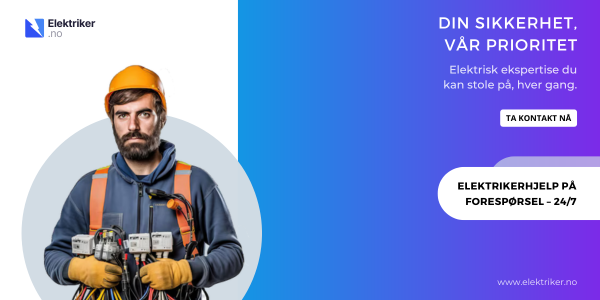
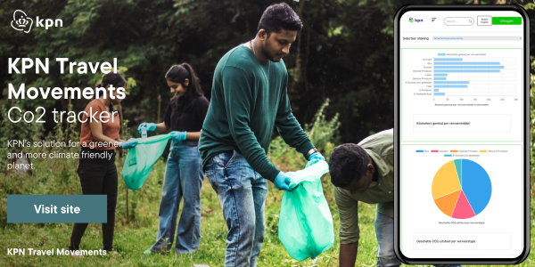

## :man_technologist:	 About Me

**Wessel van Dalen**  
*Scrum Master & Full Stack Developer :rocket:*	 
I am a 20 year old guy born in the Netherlands. My hobbies are bodybuilding, learning Norwegian (language & culture) and going on adventure with my dog (Rowdy, Golden Retriever)!

## Skills

A showcase of all my knowledge of programming languages and frameworks / libraries & process skills.

| Back End | Front End | Database | Process |
|----------|-----------|----------|---------|
| Java | HTML5 | PostgreSQL | Scrum Master |
| Python | CSS3 | H2 Database | Extreme Programming |
| Spring | JavaScript |  | Agile |
| Hibernate | React |  |  |
|  | Lit + Vite |  | |

## Education

- **Degree:** HBO ICT
- **University:** Hogeschool Utrecht
- **Year:** 2022 - 2026

## Contact Me

- **Email:** wesselvandalen@gmail.com
- **LinkedIn:** [LinkedIn Profile](https://www.linkedin.com/in/wesselvandalen/)
- **Portfolio:** [My own portfolio](https://wesselvandalen.github.io/)

## Projects

### Elektriker.no
 

- **Description:** Elektriker.no (*Elektriker is Norwegian for electrician) is a platform connecting Norwegians with skilled electricians for various electrical tasks, from fixing power outlets to installing lighting systems. 
    It simplifies the process of finding reliable help for electrical needs.
- **Link:** [Elektriker.no site](https://wesselvandalen.github.io/elektriker.no/)
- **Technologies:** Java, Spring, HTML, CSS. JavaScript, Lit, Vite, Routing

### KPN Travel Movements

- **Description:** KPN Travel Movements is an application for KPN, the leading telemarketing company in the Netherlands, to be able to register it's employees co2 emissions to the Dutch government due to the law CO₂-reductie werkgebonden personenmobiliteit.
- **Link:** [KPN Travel Movements site](https://hu-sd-sv2fe-studenten-2324.github.io/v2fe-eindopdracht-v2d_peer/)
- **Technologies:** Vite, Lit, HTML, CSS, JavaScript, Routing, RxJs

## Fun Fact about me

I'm fluent in 3 languages: Dutch, English and Norwegian (both bokmål and nynorsk).

<!--
**wesselvandalen/wesselvandalen** is a ✨ _special_ ✨ repository because its `README.md` (this file) appears on your GitHub profile.

Here are some ideas to get you started:

- 🔭 I’m currently working on ...
- 🌱 I’m currently learning ...
- 👯 I’m looking to collaborate on ...
- 🤔 I’m looking for help with ...
- 💬 Ask me about ...
- 📫 How to reach me: ...
- 😄 Pronouns: ...
- ⚡ Fun fact: ...
-->