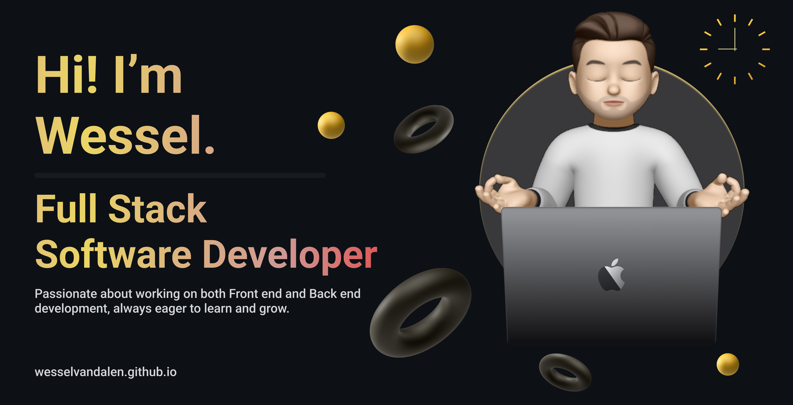

Hei hei! My name is **Wessel van Dalen**.

Take a look at <a href="https://wesselvandalen.github.io/" target="_blank">my portfolio</a> to get a better idea of me!

- 🔭 I’m currently studying Software Development IT at the Hogeschool Utrecht.
- 🌱 I’m currently learning React JS (and TS).
- 💬 Ask me about Java (Spring), React or just about anything!
- 📫 How to reach me: send me an <a href="mailto:wesselvandalen@gmail.com">e-mail</a> / a message on <a href="https://linkedin.com/in/wesselvandalen/" target="_blank">LinkedIn</a>, or add me on <a href="https://www.discordapp.com/users/bjarndal" target="_blank">Discord</a>.
- ⚡ Fun fact: I speak fluent Norwegian (bokmål), Dutch and English!
